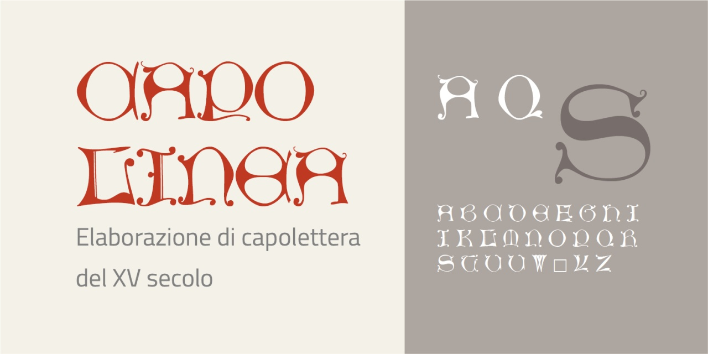
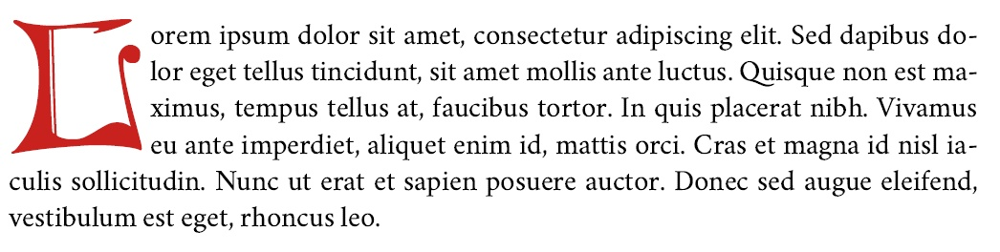

# Capolinea
- Versione 1.101: fix esportazione
- Versione 1.011: aggiunta variante _S_
- Versione 1.010: aggiunta varianti _A D I_
- Versione 1.0: versione iniziale

Per testare il font, vedere la [pagina interattiva](https://m-casanova.github.io/Capolinea/).

## Descrizione

**Capolinea** è basato su scansioni dei capolettera del XV secolo di Günther Zainer ([GfT0667](https://tw.staatsbibliothek-berlin.de/html/gftview.xql?url=../gft/GfT0667.png&gft=GfT0667),
[GfT0668](https://tw.staatsbibliothek-berlin.de/html/gftview.xql?url=../gft/GfT0668.png&gft=GfT0668)), estraendo solo la forma della lettera.

Non è presente la lettera _X_. Sono presenti varianti per le lettere _A D I S_, accessibili tramite caratteristica '**ss01**'.

Esempio di uso del font _Capolinea_ con il [font Vermiglione](https://github.com/m-casanova/Vermiglione) (elaborazione tramite LibreOffice).

