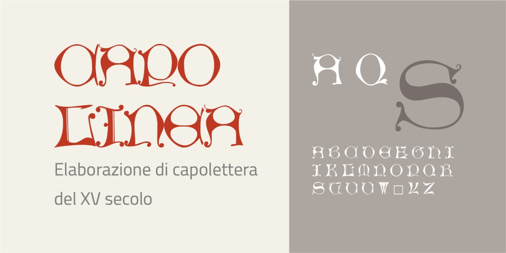
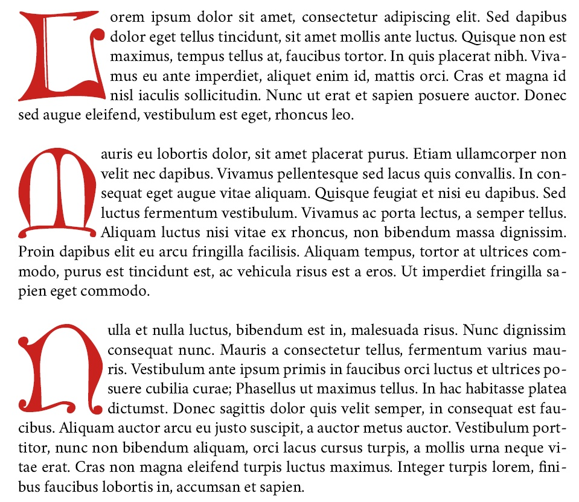

# Capolinea
- Versione 1.0: versione iniziale.

Per testare il font nella versione variabile, vedere la [pagina interattiva](https://m-casanova.github.io/Capolinea/).

## Descrizione

**Capolinea** è basato su scansioni dei capolettera del XV secolo di Günther Zainer ([GfT0667](https://tw.staatsbibliothek-berlin.de/html/gftview.xql?url=../gft/GfT0667.png&gft=GfT0667),
[GfT0668](https://tw.staatsbibliothek-berlin.de/html/gftview.xql?url=../gft/GfT0668.png&gft=GfT0668)), estraendo solo la forma della lettera. Non è presente la lettera _X_.

Esempio di uso del font _Capolinea_ con il [font Vermiglione](https://github.com/m-casanova/Vermiglione) (elaborazione tramite LibreOffice).

